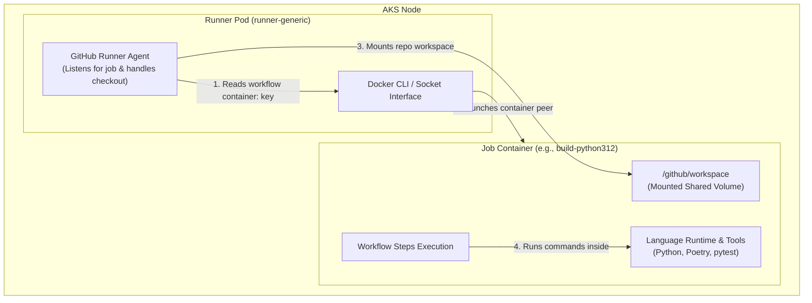

# AKS GitHub Runners: `job-containers/` Pattern vs. `docker-dind`

> [!NOTE]
> **Repository Path**: [jobcontainers/job-container.md](file:///D:/repositories/github-selfhosted-runner/jobcontainers/job-container.md)  
> **Status**: Implemented / Production Standard  
> **Target Architecture**: AKS (Azure Kubernetes Service) + ARC (Actions Runner Controller)

---

## 1. Core Architectural Distinction

In a Kubernetes-based self-hosted GitHub Actions environment (ARC), toolchains (Python, Node.js, Go, Java, Terraform, etc.) can reside in one of two distinct places:

1. **The Runner Pod itself** ([images/runner-generic](file:///D:/repositories/github-selfhosted-runner/images/runner-generic/Dockerfile), `images/runner-python`, etc.)  
   This is the Kubernetes pod provisioned by ARC that registers with GitHub, listens for queued jobs, and manages step execution.
2. **A Job Container**, specified via the `container:` key in the workflow YAML  
   The runner pod remains minimal and generic. When a job starts, the runner agent pulls the specified job container image and executes all job `steps:` inside that container environment.

```yaml
jobs:
  build:
    runs-on: [self-hosted, generic]                   # <- Minimal runner pod (ARC scale set)
    container:
      image: ghcr.io/yourorg/build-python312:latest   # <- job-containers/build-python312
    steps:
      - run: python --version   # Executes inside build-python312, NOT on the runner pod
```

The subdirectories in [jobcontainers/](file:///D:/repositories/github-selfhosted-runner/jobcontainers) contain lightweight, task-specific Dockerfiles designed for option 2.

---

## 2. Why Maintain Both Patterns?

### Without `job-containers/` (Runner Scale Set Sprawl)
Giving a pipeline a dedicated environment (e.g. Python 3.12 + custom OS libs) without job containers requires building a full **Runner Scale Set**:
- A dedicated `RunnerScaleSet` CRD in AKS
- A custom ARC Helm values file (`values-python312.yaml`)
- Unique runner labels (`[self-hosted, python-312]`)
- Idle pods running in Kubernetes waiting for jobs to arrive

This results in excessive infrastructure overhead for single-repo toolchains, temporary build requirements, or frequent patch version upgrades.

### With `job-containers/` (Dynamic Injection)
You maintain a small, fixed set of generic runner pools (`runner-generic` and `runner-docker-dind`). Individual workflows pull their exact execution environment dynamically at runtime:
- No new Kubernetes Scale Sets required
- No extra Helm deployments
- Zero idle compute wasted for unused toolchains
- Decoupled lifecycle between runner agent maintenance and language runtime updates

---

## 3. Decision Matrix: When to Use Which Pattern

| Scenario / Requirement | Recommended Pattern | Target Location |
| :--- | :--- | :--- |
| Toolchain used by **hundreds of pipelines**, stable & heavy | Dedicated Runner Scale Set | `images/runner-*` |
| Toolchain specific to **one repo/team**, or changes frequently | Job Container (`container:`) | `job-containers/*` |
| Need to run multiple language versions (Node 18 vs Node 20) on same runner pool | Job Container (`container:`) | `job-containers/*` |
| Job requires `docker build` / `docker push` / Privileged DinD | Dedicated DinD Scale Set | `images/runner-docker-dind` |
| Fast PR gate linting / static code analysis | Job Container (`container:`) | `job-containers/lint-only` |
| Cross-repository security & vulnerability scanning | Job Container (`container:`) | `job-containers/security-scan` |

---

## 4. Execution Mental Model & Architecture



1. **ARC Listener** detects a queued job requesting `[self-hosted, generic]` and scales a `runner-generic` pod in AKS.
2. **Runner Pod** registers with GitHub Actions and receives the job payload.
3. **Runner Agent** parses the `container:` key, pulls the specified image (e.g., `ghcr.io/yourorg/build-python312:latest`), and invokes `docker run`.
4. **Shared Volume** mounted automatically at `/github/workspace` bridges the runner pod and the job container.
5. **Workflow Steps** run directly inside `build-python312`.
6. Upon job completion, the job container stops and the runner pod is torn down or reclaimed.

---

## 5. DinD (Docker-in-Docker) vs. Job Containers

> [!WARNING]
> **DinD Privilege Limitation**: Job containers run as unprivileged peer containers and **cannot** run nested Docker daemons. Any job executing `docker build` or `docker push` MUST target the dedicated `runner-docker-dind` scale set.

### Comparison Table

| Feature / Aspect | Job Container Pattern (`container:`) | DinD Scale Set Pattern (`runner-docker-dind`) |
| :--- | :--- | :--- |
| **Primary Purpose** | Code compilation, unit testing, linting, packaging | Image building (`docker build`), containerized integration tests |
| **Pod Security Context** | Unprivileged (`privileged: false`) | Privileged (`privileged: true`) or sidecar daemon |
| **Runner Agent Location** | Inside `runner-generic` pod | Inside `runner-docker-dind` pod |
| **Toolchain Maintenance** | In cheap, disposable Docker images | Baked directly into the runner pod image |
| **Scale Set Count** | 1 generic pool shared by all language jobs | 1 dedicated privileged pool |

---

## 6. Complete Job-Container Catalog & Directory Structure

All job container Dockerfiles are maintained under the [jobcontainers/](file:///D:/repositories/github-selfhosted-runner/jobcontainers) directory. Each container is built without the GitHub runner agent, keeping image sizes small and pull times fast.

| Job Container Image | Dockerfile Location | Base Image | Purpose & Key Included Tools |
| :--- | :--- | :--- | :--- |
| `build-android-sdk` | [Dockerfile](file:///D:/repositories/github-selfhosted-runner/jobcontainers/build-android-sdk/Dockerfile) | `eclipse-temurin:17-jdk` | Android SDK builds, Gradle, Java 17, git, curl |
| `build-ansible` | [Dockerfile](file:///D:/repositories/github-selfhosted-runner/jobcontainers/build-ansible/Dockerfile) | `python:3.11-slim` | Ansible automation, `ansible-lint`, OpenSSH client, sshpass |
| `build-cpp-gcc12` | [Dockerfile](file:///D:/repositories/github-selfhosted-runner/jobcontainers/build-cpp-gcc12/Dockerfile) | `gcc:12` | C/C++ compilation, CMake, Ninja build system, git |
| `build-docs` | [Dockerfile](file:///D:/repositories/github-selfhosted-runner/jobcontainers/build-docs/Dockerfile) | `python:3.11-slim` | Documentation site generation via Sphinx and MkDocs |
| `build-dotnet8` | [Dockerfile](file:///D:/repositories/github-selfhosted-runner/jobcontainers/build-dotnet8/Dockerfile) | `mcr.microsoft.com/dotnet/sdk:8.0` | .NET 8 SDK applications, `dotnet` CLI, git, curl |
| `build-golang122` | [Dockerfile](file:///D:/repositories/github-selfhosted-runner/jobcontainers/build-golang122/Dockerfile) | `golang:1.22-bookworm` | Go 1.22 services, `golangci-lint`, git, ca-certificates |
| `build-java17` | [Dockerfile](file:///D:/repositories/github-selfhosted-runner/jobcontainers/build-java17/Dockerfile) | `eclipse-temurin:17-jdk` | Java 17 LTS enterprise apps, Maven, Gradle, git |
| `build-java21` | [Dockerfile](file:///D:/repositories/github-selfhosted-runner/jobcontainers/build-java21/Dockerfile) | `eclipse-temurin:21-jdk` | Java 21 LTS apps (Virtual Threads), Maven, Gradle, git |
| `build-node18` | [Dockerfile](file:///D:/repositories/github-selfhosted-runner/jobcontainers/build-node18/Dockerfile) | `node:18-slim` | Legacy Node.js 18 web applications and libraries |
| `build-node20` | [Dockerfile](file:///D:/repositories/github-selfhosted-runner/jobcontainers/build-node20/Dockerfile) | `node:20-slim` | Modern Node.js 20 web apps, APIs, npm, git |
| `build-php81` | [Dockerfile](file:///D:/repositories/github-selfhosted-runner/jobcontainers/build-php81/Dockerfile) | `php:8.1-cli` | PHP 8.1 web applications, Composer package manager, zip/unzip |
| `build-python311` | [Dockerfile](file:///D:/repositories/github-selfhosted-runner/jobcontainers/build-python311/Dockerfile) | `python:3.11-slim` | Python 3.11 apps, Poetry, pytest, pipenv, build-essential |
| `build-python312` | [Dockerfile](file:///D:/repositories/github-selfhosted-runner/jobcontainers/build-python312/Dockerfile) | `python:3.12-slim` | Modern Python 3.12 microservices, Poetry, pytest, build-essential |
| `build-ruby32` | [Dockerfile](file:///D:/repositories/github-selfhosted-runner/jobcontainers/build-ruby32/Dockerfile) | `ruby:3.2-slim` | Ruby 3.2 web applications, Rails, build-essential, git |
| `build-rust` | [Dockerfile](file:///D:/repositories/github-selfhosted-runner/jobcontainers/build-rust/Dockerfile) | `rust:1.75-slim` | Rust systems code, Cargo, Clippy, rustfmt, build-essential |
| `build-terraform` | [Dockerfile](file:///D:/repositories/github-selfhosted-runner/jobcontainers/build-terraform/Dockerfile) | `hashicorp/terraform:1.8` | Terraform 1.8 IaC pipelines, curl, unzip, python3, pip3, git, bash |
| `lint-only` | [Dockerfile](file:///D:/repositories/github-selfhosted-runner/jobcontainers/lint-only/Dockerfile) | `node:20-slim` | Ultra-fast multi-language linter: ESLint, Prettier, ShellCheck, Black |
| `security-scan` | [Dockerfile](file:///D:/repositories/github-selfhosted-runner/jobcontainers/security-scan/Dockerfile) | `alpine:3.19` | Lightweight security scanner environment: curl, git, bash, jq |

---

## 7. Precise Dockerfile Source Codes

### Python 3.12 Container: [build-python312/Dockerfile](file:///D:/repositories/github-selfhosted-runner/jobcontainers/build-python312/Dockerfile)
```dockerfile
FROM python:3.12-slim

RUN apt-get update && apt-get install -y --no-install-recommends \
    build-essential git curl \
    && rm -rf /var/lib/apt/lists/*

RUN pip install --no-cache-dir poetry pytest

WORKDIR /workspace
```

### Go 1.22 Container: [build-golang122/Dockerfile](file:///D:/repositories/github-selfhosted-runner/jobcontainers/build-golang122/Dockerfile)
```dockerfile
FROM golang:1.22-bookworm

RUN apt-get update && apt-get install -y --no-install-recommends \
    git ca-certificates \
    && rm -rf /var/lib/apt/lists/*

RUN go install github.com/golangci/golangci-lint/cmd/golangci-lint@latest

WORKDIR /workspace
```

### Terraform Container: [build-terraform/Dockerfile](file:///D:/repositories/github-selfhosted-runner/jobcontainers/build-terraform/Dockerfile)
```dockerfile
FROM hashicorp/terraform:1.8

RUN apk add --no-cache curl unzip python3 py3-pip git bash

WORKDIR /workspace
```

### Multi-Language Linter Container: [lint-only/Dockerfile](file:///D:/repositories/github-selfhosted-runner/jobcontainers/lint-only/Dockerfile)
```dockerfile
FROM node:20-slim

RUN npm install -g eslint prettier

RUN apt-get update && apt-get install -y --no-install-recommends \
    shellcheck python3-pip git \
    && pip3 install --no-cache-dir --break-system-packages black \
    && rm -rf /var/lib/apt/lists/*

WORKDIR /workspace
```

### Security Scanning Container: [security-scan/Dockerfile](file:///D:/repositories/github-selfhosted-runner/jobcontainers/security-scan/Dockerfile)
```dockerfile
FROM alpine:3.19

RUN apk add --no-cache curl git bash jq

WORKDIR /workspace
```

---

## 8. Workflow Integration Examples

### Example A: Python 3.12 Application Pipeline
```yaml
name: Python 3.12 Build & Test

on: [push, pull_request]

jobs:
  test:
    runs-on: [self-hosted, generic]
    container:
      image: ghcr.io/yourorg/build-python312:latest
    steps:
      - uses: actions/checkout@v4
      - name: Verify Python Version
        run: python --version
      - name: Install Dependencies
        run: poetry install
      - name: Run Tests
        run: pytest
```

### Example B: Node.js 20 Pipeline
```yaml
name: Node 20 Build & Test

on: [push, pull_request]

jobs:
  build:
    runs-on: [self-hosted, generic]
    container:
      image: ghcr.io/yourorg/build-node20:latest
    steps:
      - uses: actions/checkout@v4
      - name: Install & Test
        run: |
          npm ci
          npm test
```

### Example C: Docker-in-Docker Image Build (Not a Job Container)
```yaml
name: Build & Push Container Image

on:
  push:
    branches: [main]

jobs:
  docker-build:
    runs-on: [self-hosted, docker-dind]   # Requires dedicated DinD runner scale set
    steps:
      - uses: actions/checkout@v4
      - name: Login to Registry
        run: echo "${{ secrets.REGISTRY_PASSWORD }}" | docker login ghcr.io -u ${{ github.actor }} --password-stdin
      - name: Build & Push
        run: |
          docker build -t ghcr.io/yourorg/myapp:${{ github.sha }} .
          docker push ghcr.io/yourorg/myapp:${{ github.sha }}
```

---

## 9. Frequently Asked Questions

### Q: How do secrets pass into the job container?
Secrets configured in GitHub Actions are automatically injected as environment variables into the runner pod. When the runner agent launches the `container:` image, it passes environment variables down automatically. No special Docker syntax or secret mounting is required in the container definition.

### Q: How does workspace directory mounting work?
GitHub Actions automatically creates a shared volume for the job workspace and mounts it at `/github/workspace` inside the job container. When `actions/checkout@v4` runs, files are checked out directly into this shared mount point.

### Q: Should I add the GitHub runner binary inside job containers?
**No.** Job containers must remain minimal and lightweight. The GitHub runner agent binary lives exclusively inside the runner pod image ([images/runner-generic/Dockerfile](file:///D:/repositories/github-selfhosted-runner/images/runner-generic/Dockerfile)).

---

## 10. Summary Reference Table

| Pattern | Execution Mechanism | Scale Set Count | Best For |
| :--- | :--- | :--- | :--- |
| **`runner-generic` + `container:`** | Dynamic container injection | 1 generic pool | Multi-language orgs, rapid version iteration, unprivileged pipelines |
| **`runner-docker-dind`** | Direct pod execution with DinD daemon | 1 dedicated pool | Building/pushing Docker images, container-in-container workflows |
| **`runner-gpu-ml` / specialized** | Custom ARC scale set | Dedicated per type | ML training, heavy native compilation, specialized hardware |
